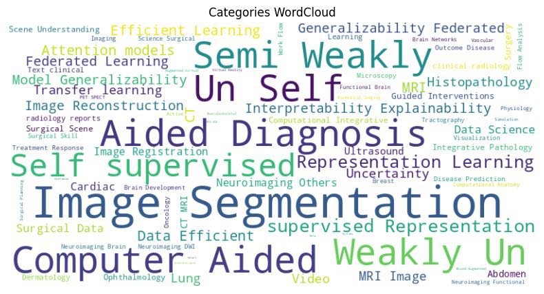
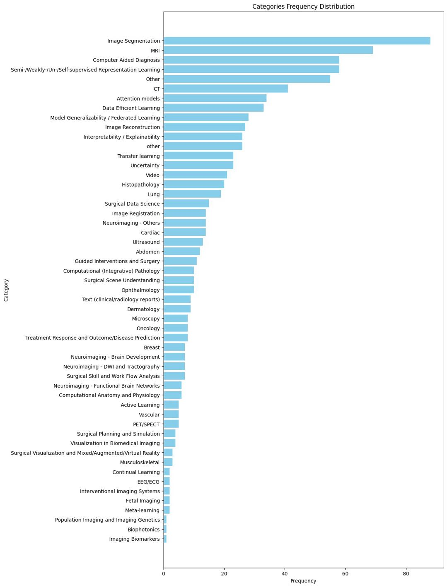

# MICCAI-Stats

## MICCAI 2023

Numerous papers do not release their source code, prompting me to compile a comprehensive report exclusively focused on papers that have made their source code accessible. I hope it will be useful to the community. Free feel to download [details](https://github.com/seanxuu/MICCAI-Stats/blob/main/MICCAI-2023/papers_data.csv).

### Word Cloud

### Frequency

